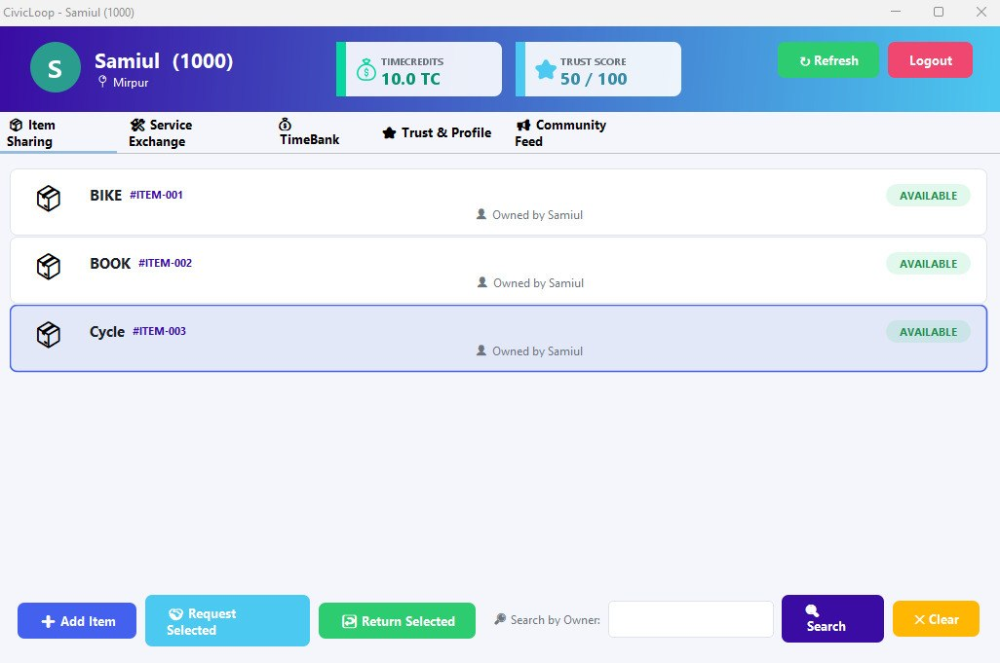

<div align="center">

# 🌐 CivicLoop

### **Hyperlocal Community Resource & Skill Sharing**

**🤝 Share Resources • ⏱️ Exchange Time • 🌱 Build Community**

<br>


</div>

> **CivicLoop** is a Java-based desktop application designed to encourage hyperlocal resource sharing, skill exchange, and community interaction through a simple **TimeCredit-based economy**.

---

## 📌 1. Project Overview

### 🇧🇩 বাংলা পরিচিতি

**CivicLoop** হলো একটি hyperlocal community resource এবং skill-sharing desktop application। এর মূল ধারণা হলো—একজন ব্যবহারকারী তার প্রয়োজনীয় resource ধার নিতে পারে, অন্যকে কোনো service প্রদান করতে পারে এবং community-এর মধ্যে নিজের সময় ও দক্ষতার বিনিময়ে **TimeCredit** অর্জন করতে পারে।

এই project-টি **Daffodil International University-এর CSE222: Object Oriented Programming Lab**-এর academic requirements-এর অংশ হিসেবে পাঁচজন শিক্ষার্থীর একটি team দ্বারা developed করা হয়েছে। এটি শুধুমাত্র একটি software project নয়; বরং Java-এর Object-Oriented Programming concepts বাস্তবে প্রয়োগ করার জন্য একটি শিক্ষামূলক implementation।

অ্যাপ্লিকেশনটি **Java SE, Java Swing এবং Java Serialization** ব্যবহার করে তৈরি করা হয়েছে। কোনো external database বা network backend-এর পরিবর্তে local serialized data file ব্যবহার করে application state সংরক্ষণ করা হয়েছে।

### 🇬🇧 English Overview

CivicLoop is a hyperlocal community platform where users can exchange physical resources, services, skills, and time.

The central concept is a **TimeCredit economy**: users earn credits by helping others and spend those credits when receiving help or accessing community resources.

The project was developed by a **five-member student team** as part of the **CSE222: Object Oriented Programming Lab**. Its primary educational objective was to demonstrate practical understanding of Java OOP principles, GUI development, file persistence, event-driven programming, and modular software design.

### 🎯 Core Technology Stack

| Technology            | Purpose                                      |
| --------------------- | -------------------------------------------- |
| ☕ Java SE 21          | Core application development                 |
| 🖥️ Java Swing        | Desktop graphical user interface             |
| 📦 Maven              | Project build and dependency management      |
| 💾 Java Serialization | Persistent local data storage                |
| 🧩 OOP                | Application architecture and domain modeling |

---

## ✨ 2. Key Features

| Feature                 | Description                                            | 🇧🇩 বাংলা                                      |
| ----------------------- | ------------------------------------------------------ | ----------------------------------------------- |
| 👤 Registration & Login | User accounts with automatically generated numeric IDs | স্বয়ংক্রিয় numeric ID সহ registration ও login   |
| 📦 Item Sharing         | Borrow and return community items                      | প্রয়োজনীয় জিনিস ধার নেওয়া ও ফেরত দেওয়া          |
| 🤝 Service Exchange     | Request and complete community services                | community-এর মধ্যে service request ও completion |
| ⏱️ TimeCredit           | Earn, spend, and track credits                         | সাহায্যের বিনিময়ে credit অর্জন ও ব্যবহার        |
| 📊 Transaction History  | Track TimeCredit transactions                          | credit-এর লেনদেনের history দেখা                 |
| ⭐ Trust & Reputation    | Report and evaluate other users                        | user-এর trust/reputation সম্পর্কিত তথ্য         |
| 📰 Community Feed       | Posts and comments                             | community post ও comment                 |
| 👤 Profile Management   | Edit name, area, bio, and skills                       | profile-এর নাম, এলাকা, bio ও skills পরিবর্তন    |
| 🔄 Refresh Data         | Synchronize data across multiple open windows          | একাধিক window-এর data refresh/sync করা          |
| 💾 Persistent Storage   | Save application data locally                          | application data local file-এ সংরক্ষণ           |

### 🚀 Feature Highlights

* 🔐 **User Registration & Login**
* 🆔 **Automatic Numeric User ID Generation**
* 📚 **Community Item Borrowing & Returning**
* 🛠️ **Skill/Service Exchange**
* ⏱️ **TimeCredit Balance & Transaction History**
* ⭐ **Trust and User Reporting**
* 💬 **Community Posts, Comments & Likes**
* 👤 **Editable User Profiles**
* 🔄 **Multi-window Data Refresh**
* 💾 **Persistent Data Using Serialization**

---
---

## 🖼️ 4. Application Screenshots

CivicLoop provides a desktop-based interface for managing community resources, user accounts, TimeCredits, and community interactions.

### 🔐 Login & Registration

<p align="center">
  
</p>

<p align="center">
  <em>Login and user registration interface</em>
</p>

---

### 📦 Item Sharing

<p align="center">
  
</p>

<p align="center">
  <em>Community item listing and resource-sharing interface</em>
</p>

---

### 📰 Community Feed

<p align="center">
  
</p>

<p align="center">
  <em>Community feed for posts and social interactions</em>
</p>

---

### ⏱️ TimeCredit & Transaction History

<p align="center">
  
</p>

<p align="center">
  <em>TimeCredit balance and transaction history</em>
</p>

---

---

## 🛠️ 3. Installation & Running

### Prerequisites

Before running CivicLoop, make sure the following are installed:

* ☕ **JDK 21 or later**
* 📦 **Apache Maven**
* 🌐 **Git**
* 💻 A Windows/Linux/macOS environment capable of running Java Swing

Verify the installations:

```bash
java -version
javac -version
mvn -version
git --version
```

### Clone the Repository

```bash
git clone https://github.com/samiul796/CivicLoop
cd CivicLoop
```

### Compile the Project

```bash
mvn clean compile
```

### Run the Application

```bash
mvn exec:java -Dexec.mainClass="civicloop.Main"
```


### 💾 Persistent Data

CivicLoop stores application data in:

```text
civicloop_data.dat
```

This file contains serialized application state such as users, posts, items, services, transactions, and other persistent information.

> **Note:** If the data file is deleted or becomes unavailable, previously stored local application data may no longer be accessible.

---

## 🖥️ 4. Usage Guide

### 🔐 Login / Registration

New users can create an account through the registration interface.

A unique numeric user ID is automatically generated for each registered user.

Existing users can authenticate through the login interface and access the main CivicLoop dashboard.

---

### 📦 Item Sharing

The Item Sharing module allows community members to make resources available to others.

Typical workflow:

```text
Owner
  │
  ▼
Create Item
  │
  ▼
Community Member Requests Item
  │
  ▼
Item Borrowed
  │
  ▼
Item Returned
```

This allows physical resources to be reused within a local community instead of being independently purchased by every user.

---

### 🤝 Service Exchange

Users can offer skills or services to other members.

Example:

```text
User A
  │
  │ Offers: Programming Help
  ▼
Community
  │
  │ Requests Service
  ▼
User B
  │
  ▼
Service Completed
```

The completed service can affect the TimeCredit balance according to the application's exchange rules.

---

### ⏱️ TimeBank / TimeCredit

The TimeCredit system is the central economic mechanism of CivicLoop.

Instead of using traditional money, users exchange **time and community contribution**.

For example:

```text
Help another user
       ↓
Earn TimeCredits
       ↓
Use TimeCredits
       ↓
Receive another service/resource
```

The system also maintains transaction information so users can track how their credits were earned and spent.

---

### ⭐ Trust & Profile

Users can maintain their personal profile, including:

* Name
* Area
* Bio
* Skills
* Other relevant profile information

The trust mechanism allows community members to report problematic behavior and provides a basic foundation for community accountability.

---

### 📰 Community Feed

The Community Feed provides a social layer for CivicLoop.

Users can:

* 📝 Create posts
* 💬 Comment
* 📢 Share community-related information

This creates a central communication space beyond resource and service exchange.

---

### 🔄 Refresh Data

Because CivicLoop is a desktop application, multiple windows may remain open simultaneously.

The **Refresh Data** functionality allows a window to reload the latest persisted application state.

Recommended workflow:

```text
Window A modifies data
        ↓
Data saved
        ↓
Window B
        ↓
Click "Refresh Data"
        ↓
Latest data loaded
```

> 💡 When working with multiple application windows, use **Refresh Data** after another window has modified shared information.

---

## 🏗️ 5. Architecture & Design

CivicLoop follows a modular Java package structure intended to separate business models, persistence, and graphical interfaces.

### 📁 Package Structure

A simplified representation:

```text
CivicLoop/
│
├── src/
│   └── main/
│       └── java/
│           └── civicloop/
│               │
│               ├── model/
│               │   ├── User.java
│               │   ├── Item.java
│               │   ├── Service.java
│               │   ├── CommunityPost.java
│               │   ├── Transaction.java
│               │   └── ...
│               │
│               ├── data/
│               │   └── DataStore.java
│               │
│               ├── gui/
│               │   ├── LoginFrame.java
│               │   ├── DashboardFrame.java
│               │   ├── ProfileFrame.java
│               │   └── ...
│               │
│               └── Main.java
│
├── civicloop_data.dat
├── pom.xml
└── README.md
```


---

### 🧠 Object-Oriented Programming Concepts

CivicLoop was designed to demonstrate several important OOP concepts.

| OOP Concept       | Application                                                            |
| ----------------- | ---------------------------------------------------------------------- |
| 🔒 Encapsulation  | Model classes protect internal state through fields and methods        |
| 🧬 Inheritance    | Shared behavior can be represented through related classes             |
| 🔄 Polymorphism   | Common interfaces/references can represent different implementations   |
| 📐 Abstraction    | Interfaces such as `Creditable` define common behavior                 |
| 🧩 Interfaces     | `Creditable` and other contracts separate behavior from implementation |
| 🏭 Factory Method | `CommunityPost` creation can centralize object construction            |
| ♻️ Singleton      | `DataStore` provides centralized access to application data            |
| 💾 Serialization  | Objects are persisted directly to a local file                         |

### 🔌 `Creditable` Interface

A conceptual example:

```java
public interface Creditable {
    void addCredits(int amount);
    boolean spendCredits(int amount);
}
```

Classes implementing this interface can participate in the application's TimeCredit-related behavior.

---

### 🗄️ `DataStore` Singleton

The `DataStore` acts as a centralized data-management component.

Conceptually:

```text
             ┌─────────────────┐
             │    DataStore    │
             │   Singleton     │
             └────────┬────────┘
                      │
        ┌─────────────┼─────────────┐
        ▼             ▼             ▼
      Users         Items        Services
        │             │             │
        └─────────────┼─────────────┘
                      ▼
              Serialized File
          civicloop_data.dat
```

This design prevents different parts of the application from independently maintaining unrelated copies of the application's primary data state.

---

### 🏭 CommunityPost Creation

Community posts can be created through a controlled construction mechanism rather than requiring every GUI component to directly manage the complete object-creation process.

Conceptually:

```text
GUI
 │
 ▼
CommunityPost Factory / Creation Method
 │
 ▼
CommunityPost Object
 │
 ▼
DataStore
 │
 ▼
civicloop_data.dat
```

---

### 💾 Persistence Architecture

CivicLoop uses Java Serialization to persist application objects.

Simplified flow:

```text
Java Objects
     │
     ▼
ObjectOutputStream
     │
     ▼
civicloop_data.dat
     │
     ▼
ObjectInputStream
     │
     ▼
Java Objects
```

This approach is appropriate for an educational desktop application where a full database/network architecture is outside the project's intended scope.

---

## 📐 6. Conceptual Class Diagram

A simplified conceptual representation:

```text
                    ┌─────────────────┐
                    │      User       │
                    ├─────────────────┤
                    │ userId          │
                    │ name            │
                    │ area            │
                    │ bio             │
                    │ skills          │
                    │ timeCredits     │
                    └────────┬────────┘
                             │
              ┌──────────────┼──────────────┐
              ▼              ▼              ▼
        ┌──────────┐   ┌───────────┐   ┌──────────────┐
        │   Item   │   │  Service  │   │ CommunityPost│
        └──────────┘   └───────────┘   └──────────────┘
              │              │                │
              └──────────────┼────────────────┘
                             ▼
                    ┌─────────────────┐
                    │    DataStore    │
                    │    Singleton    │
                    └────────┬────────┘
                             │
                             ▼
                    civicloop_data.dat
```

This diagram is intentionally simplified to communicate the main relationships rather than every class and dependency in the application.

---

## ⚙️ 7. Challenges & Solutions

### 🔄 Multi-window Synchronization

**Challenge:** Multiple Swing windows can contain outdated in-memory data.

**Solution:** A dedicated **Refresh Data** mechanism reloads the latest persisted state so that an open window can update its displayed information.

---

### 🎨 Swing UI Design

**Challenge:** Java Swing provides low-level GUI components, making modern-looking interfaces more difficult to create.

**Solution:** Consistent layouts, panels, buttons, colors, typography, spacing, and reusable UI components were used to create a more coherent desktop experience.

---

### ⭐ Trust Reporting Logic

**Challenge:** Community reporting requires identifying the correct target user while preventing confusion between the reporting user and reported user.

**Solution:** User IDs and application-level data structures are used to associate reports with the appropriate users.

---

### 💾 Persistent Storage Without a Database

**Challenge:** The project was developed without an external database.

**Solution:** Java's built-in serialization mechanism was used to store application objects in `civicloop_data.dat`.

---

### 🎓 Educational Constraints

The project intentionally focuses on concepts covered by the OOP course.

The implementation avoids depending on a large external technology stack such as:

```text
❌ External Database
❌ Cloud Backend
❌ REST API
❌ Real-time WebSocket Infrastructure
❌ Mobile Framework
```

Instead, the project emphasizes:

```text
✅ Core Java
✅ Object-Oriented Programming
✅ Java Swing
✅ Event Handling
✅ Collections
✅ File I/O
✅ Serialization
```

> 🎯 The limitations are part of the educational design: the goal was to demonstrate understanding of fundamental Java and OOP concepts rather than to build a production-scale distributed platform.

---

## 👥 8. Team & Acknowledgments

### 🇧🇩 আমাদের টিম

CivicLoop তৈরি করা হয়েছে **CSE222: Object Oriented Programming Lab**-এর একটি পাঁচ সদস্যের student team দ্বারা।

| 👥 Team Member               | 🆔 Student ID | 💼 Contribution                      |
| ---------------------------- | ------------- | ------------------------------------ |
| **Md. Samiul Islam**         | `251-15-796`  | Development & OOP Implementation     |
| **S.M. Shohag Hossain Emon** | `251-15-227`  | GUI Development                      |
| **Afia Shaira**              | `251-15-650`  | Data Management & Testing            |
| **Promit Mondol**            | `251-15-214`  | Feature Development                  |
| **Anika Nishat**             | `251-15-355`  | Integration, Documentation & Testing |


এই project-এর মাধ্যমে আমরা Java Swing, OOP design, file persistence, event-driven programming এবং team-based software development সম্পর্কে বাস্তব অভিজ্ঞতা অর্জন করেছি।

---

## 🗺️ 9. Future Work & Roadmap

CivicLoop-এর ভবিষ্যৎ version-এ নিম্নলিখিত উন্নয়নগুলো যুক্ত করা যেতে পারে:

| Priority     | Enhancement                           |
| ------------ | ------------------------------------- |
| 🔴 High      | Database-backed persistent storage    |
| 🔴 High      | Secure password hashing               |
| 🟠 Medium    | Real-time synchronization             |
| 🟠 Medium    | REST API / backend architecture       |
| 🟠 Medium    | Advanced trust & reputation algorithm |
| 🟡 Future    | Mobile application                    |
| 🟡 Future    | Push notifications                    |
| 🟡 Future    | Location-aware community discovery    |
| 🟡 Future    | Admin moderation dashboard            |
| 🟡 Future    | Analytics and community statistics    |
| 🟢 Long-term | Cloud deployment                      |

A possible future architecture could evolve into:

```text
                 ┌──────────────────┐
                 │   Web / Mobile   │
                 │     Clients      │
                 └────────┬─────────┘
                          │
                          ▼
                 ┌──────────────────┐
                 │    REST API      │
                 │     Backend      │
                 └────────┬─────────┘
                          │
             ┌────────────┼────────────┐
             ▼            ▼            ▼
         PostgreSQL    Auth System   Real-time
                                    Services
```

---

## 📜 10. License

This project was developed primarily for **educational and academic purposes** as part of the CSE222 Object Oriented Programming Lab.

Unless a separate license is added by the project owners:

> **All rights reserved.**

The project may be modified to use an open-source license such as **MIT License** if the team decides to publish the source code for broader reuse.

---

## 📊 11. Project Snapshot

| Category        | Details                       |
| --------------- | ----------------------------- |
| 🚀 Project      | CivicLoop                     |
| 🎯 Domain       | Hyperlocal Community Exchange |
| ☕ Language      | Java                          |
| 🖥️ GUI         | Java Swing                    |
| 📦 Build        | Maven                         |
| 💾 Storage      | Java Serialization            |
| 🧠 Architecture | OOP-based Modular Design      |
| 👥 Team         | 5 Students                    |
| 🎓 Course       | CSE222 OOP Lab                |
| 🧪 Project Type | Academic Desktop Application  |
| 📈 Status       | Beta / Educational            |

---

## 🧪 12. Example Development Commands

Clean the project:

```bash
mvn clean
```

Compile:

```bash
mvn clean compile
```

Package:

```bash
mvn package
```

Run:

```bash
mvn exec:java -Dexec.mainClass="civicloop.Main"
```

Check Java version:

```bash
java -version
```

---

## 🔐 13. Important Notes

> ⚠️ **Local Storage:** CivicLoop currently uses local Java serialization rather than a production database.

> ⚠️ **Security:** This academic implementation should not be considered production-ready authentication or security infrastructure.

> 💡 **Data Synchronization:** If multiple application windows are open, use **Refresh Data** after changes made elsewhere.

> 🎓 **Educational Scope:** The architecture intentionally prioritizes Java/OOP learning objectives over enterprise-level infrastructure.

---

## 🌟 14. Why CivicLoop?

CivicLoop explores a simple question:

> **What if communities could exchange resources and skills based on time and contribution rather than only money?**

A person may have unused resources, useful skills, or simply time available to help someone else.

CivicLoop attempts to turn those contributions into a structured community exchange system:

```text
       RESOURCE
          │
          ▼
       SERVICE
          │
          ▼
       TIME
          │
          ▼
      TIMECREDIT
          │
          ▼
       COMMUNITY
          │
          └──────────────► 🤝
```

The result is a small-scale demonstration of how software can model real-world social and economic interactions using fundamental programming concepts.

---

## ❤️ 15. Acknowledgment

Special acknowledgment is given to the course instructors, teammates, and everyone involved in the development and evaluation of this academic project.

### 🇧🇩 শেষ কথা

CivicLoop আমাদের জন্য শুধু একটি Java Swing application নয়—এটি Object-Oriented Programming-এর ধারণাগুলোকে একটি বাস্তব সমস্যার সঙ্গে যুক্ত করার একটি শিক্ষামূলক প্রচেষ্টা। Teamwork, debugging, UI design, data management এবং software architecture—প্রতিটি ধাপে project development আমাদের practical learning experience দিয়েছে।

---

## 🔗 16. Repository & Contact

**GitHub Repository:**
`https://github.com/samiul796/CivicLoop`

For project-related questions, contributions, or academic discussion, please refer to the project repository and its issue/discussion section.

---

<p align="center">

### 🚀 CivicLoop

**Share Resources. Exchange Skills. Build Community.**

**Made with ☕ Java + 🧠 OOP + 🤝 Teamwork**

⭐ If you find the project interesting, consider giving the repository a star.

</p>

---

<p align="center">
  <sub>Academic Project • CSE222 Object Oriented Programming Lab • Daffodil International University</sub>
</p>